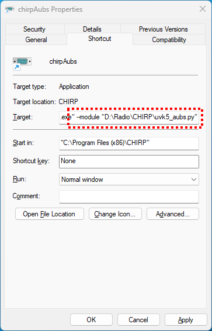
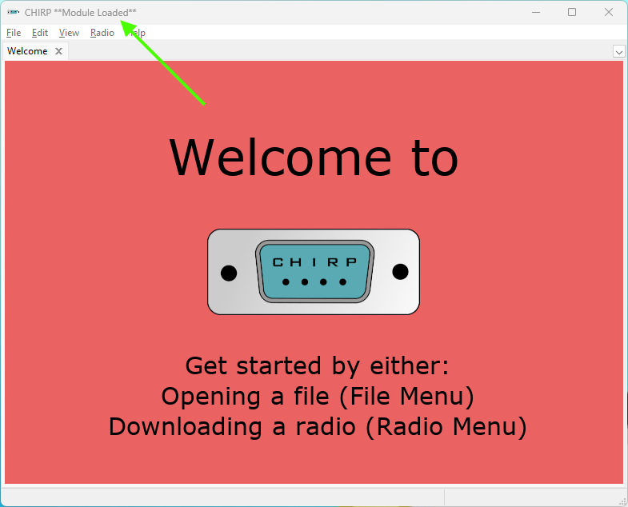

# Introduction

CHIRP driver for UV-K5/K6/5R radios running [Aubs firmware](https://github.com/AubsUK/uv-k5-firmware-custom) fork of [Egzumer firmware](https://github.com/egzumer/uv-k5-firmware-custom)
The only real difference are the addition of scan lists and channel lockout (memory channel skip) capability.

This is a modification of the [Egzumer uvk5 driver](https://github.com/egzumer/uvk5-chirp-driver) which itself is a modification of a driver created by: 
(c) 2023 Jacek Lipkowski <sq5bpf@lipkowski.org> 
Licensed cc-by-sa-4.0

Thanks to Egzumer for all the hard work they've done for the radio firmware and CHIRP driver.

# How to use

> [!IMPORTANT]
> This driver is a very early version and has NOT been added to the official [CHIRP release](https://chirp.danplanet.com/projects/chirp/wiki/Download).  
> If you find any issues that are clearly related to this driver, please report them here and not to the CHIRP team.  

Almost everything about this driver is the same as the Egzumer driver.

You can use development version of the driver [uvk5_Aubs.py](uvk5_Aubs.py?raw=1) (right click, "Save link as...") and load it to CHIRP manually.
> [!IMPORTANT]
This driver is an extension of the UV-K5 driver that was modified to accept driver extensions. You have to use a CHIRP version that was released after 01.02.2024 that contains the correct base driver.
> Choose `UV-K5` radio model in the CHIRP download window. It will automatically recognize Aubs firmware if it is on your radio, and all extra options will be available. You should see radio model changed to `UV-K5 Aubs in the "Upload to radio..." function window.  

## Loading with menu
1. go to menu `Help` and turn on `Developer mode`
2. Restart CHIRP
3. Go to menu `File`, `Load module...`
4. Choose the downloaded `uvk5_aubs.py`.

## Loading with CHIRP input argument
1. Create a shortcut to CHIRP program (e.g. right click on the desktop and select New >> Shortcut)
2. Edit the shortcut settings, in the target field add at the end `--module PATH_TO_DRIVER` (replace `PATH_TO_DRIVER` with a real path) example : "C:\Program Files (x86)\CHIRP\chirpwx.exe" --module D:\Radio\CHIRP\uvk5_aubs.py"

3. Run CHIRP with the shortcut, it will automatically load the driver.

## Custom channel settings

By default CHIRP shows only default channel options, that are universal for all types radios. You can see and change custom channel settings by going to menu `View` and turning on `Show extra fields`, this will show more options in the `Memories` tab.

# Custom firmware build options

This driver supports custom firmware builds exactly like the Egzumer firmware and detects which [options](https://github.com/egzumer/uv-k5-firmware-custom?tab=readme-ov-file#user-customization) (from Egzumer's repo) have been used.
Disabled options will be hidden in CHIRP. This only works if the configuration was read from a specific radio. You can use configuration files from other radios with different build options, but unsupported settings will be reset to defaults on the target radio.

# Calibration settings

Those setting are not uploaded to the radio by default. If you make some changes in the calibration and you want to save it, you have to enable the `Upload calibration` option before uploading. If this is enabled only the calibration part of the configuration data is sent to the radio, without channels and other settings. 

Use this option at your own risk. Make a backup of the calibration first! Some settings are calibrated at the factory and each radio has different and unique calibration data. You will not be able to restore those setting using some other radios settings. Be carefull not to use CHIRP config file that was downloaded from other radio. Each CHIRP config contains full EEPROM dump, it always did, even the original UV-K5 driver did this, so if you have some old config saved it also contains calibration section and can be used to restore the calibration, but the best way to make a backup is to use software that doesn't depend on CHIRP driver, like [k5prog-win](https://github.com/OneOfEleven/k5prog-win/raw/main/k5prog_win.exe).

Calibration settings are raw values read from the EEPROM, not recalculated to dBm, dB or any particular units. All the settings are presented as they were in the stock Quansheng firmware. Not all calibration settings are used the same way by Aubs firmware:
- Squelch - sensitivity is doubled if ENABLE_SQUELCH_MORE_SENSITIVE is enabled (enabled by default)
- Microphone sensitivity - not used at all
- RSSI levels - only used for small RSSI bar indicator if the firmware is built with the custom S-meter disabled (ENABLE_RSSI_BAR = 0)
- TX power - if built with ENABLE_REDUCE_LOW_MID_TX_POWER then medium power is further divided by 3, low power is divided by 5 (not enabled by default)
- Battery - only level 3 is used
